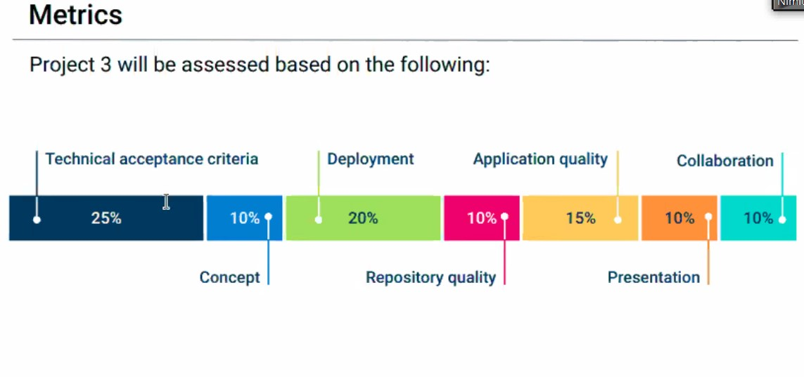

# Interactive MERN Stack Single-Page Application
Projects have played a key role in your journey to becoming a full-stack web developer. As you apply for development jobs, your portfolio is absolutely vital to opening doors to opportunities. Your portfolio showcases high-quality deployed examples of your work, and you can use your finished projects for that very purpose.

This project is a fantastic opportunity to show employers your collaborative skills and coding abilities, especially in the context of a scalable, user-focused MERN app. Remember that employers want to know what you can do, but they also want to know how you work with other developers. The more examples of deployed collaborative work you have in your portfolio, the more likely you are to get an interview and a job.

# Project Requirements
With your group, you’ll again conceive and execute a design that solves a real-world problem. In creating your first collaborative MERN-stack single-page application, you’ll combine a scalable MongoDB back end, a GraphQL API, and an Express.js and Node.js server with a React front end, implementing user authentication with JWT to build a user-focused platform. You’ll continue to build on the agile development methodologies you’ve used throughout this course. These include storing your project code in GitHub, managing your work with a project management tool, and implementing feature and bug fixes using the Git branch workflow and pull requests.

For this project, you should start from scratch. Doing so will allow you to revisit your front-end abilities in the context of React and solidify your understanding of working with multiple servers in a MERN application. Your skills have continued to improve since the first two projects, so naturally your approach will be different considering the experience you’ve gained with each new application you’ve built.

Your group will use everything you’ve learned throughout this course to create a MERN-stack single-page application that works with real-world data to solve a real-world challenge, with a focus on data and user demand. This project will provide you with the best opportunity to demonstrate your problem-solving skills, which employers will want to observe. Once again, the user story and acceptance criteria will depend on the project that you create, but your project must fulfill the following requirements:

## Use React for the front end.

## Use GraphQL with a Node.js and Express.js server.

## Use MongoDB and the Mongoose ODM for the database.

## Use queries and mutations for retrieving, adding, updating, and deleting data.

## Be deployed using Heroku (with data).

## Have a polished UI.

## Be responsive.

## Be interactive (i.e., accept and respond to user input).

## Include authentication (JWT).

## Protect sensitive API key information on the server.

Have a clean repository that meets quality coding standards (file structure, naming conventions, best practices for class and id naming conventions, indentation, high-quality comments, and so on).

Have a high-quality README (with unique name, description, technologies used, screenshot, and link to deployed application).

Finally, you must add your project to the portfolio that you created in Module 20.

You should also consider the following suggestions to help your project stand out.

## CSS Styling
Instead of using a CSS library like Bootstrap, consider one of the following suggestions:

Explore the concept of CSS-in-JS, which abstracts CSS to the component level, using JavaScript to describe styles in a declarative and maintainable way. Some popular libraries include styled-componentsLinks to an external site. and EmotionLinks to an external site..

Try using a component library, such as Semantic UILinks to an external site., Chakra UILinks to an external site., or Ant DesignLinks to an external site..

Create all the CSS for your application just using CSS.

Ultimately, it doesn't matter which of these options you choose—it just needs to look professional and be mobile-friendly.

## Payment Platform (optional)
Consider integrating the Stripe payment platform. Even if you don’t create an e-commerce application, you could set up your site to accept charitable donations.

## Bonus
Although this is not a requirement for your project, try to also implement functionality to meet the minimum requirements of a PWA:

## Uses a web manifest.

## Uses a service worker for offline functionality.

## Is installable.

## Presentation Requirements
Use this project presentation templateLinks to an external site. to address the following:

## Elevator pitch: A one-minute description of your application.

## Concept: What is your user story? What was your motivation for development?

## Process: What were the technologies used? How were tasks and roles broken down and assigned? What challenges did you encounter? What were your successes?

## Demo: Show your stuff!

## Directions for future development.

## Links to the deployed application and the GitHub repository. Use the Guide to Deploy with Heroku and MongoDB Atlas on the Full-Stack BlogLinks to an external site. if you need a reminder on how to deploy to Heroku.
